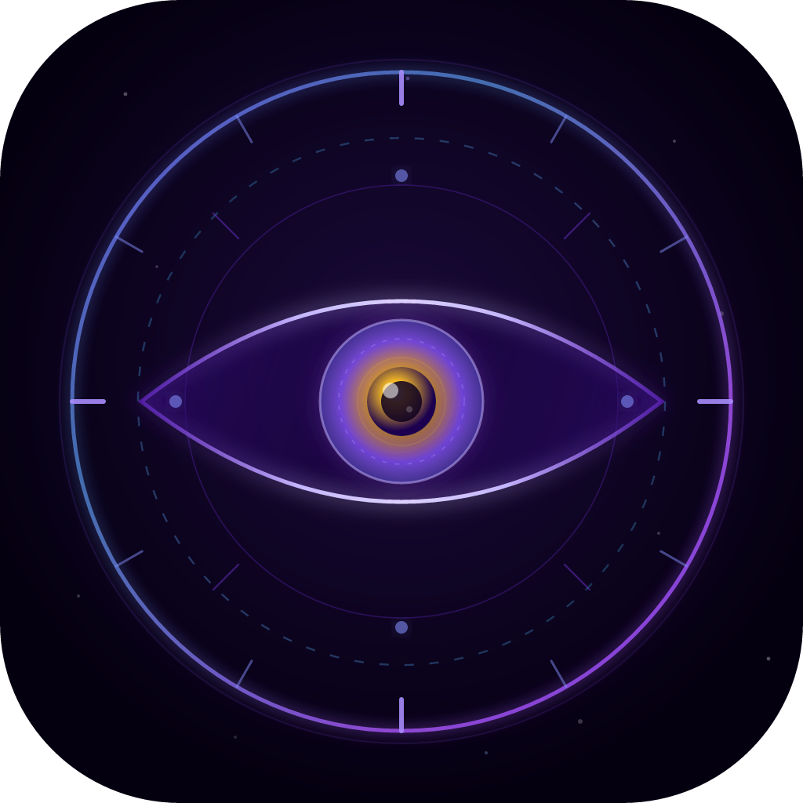
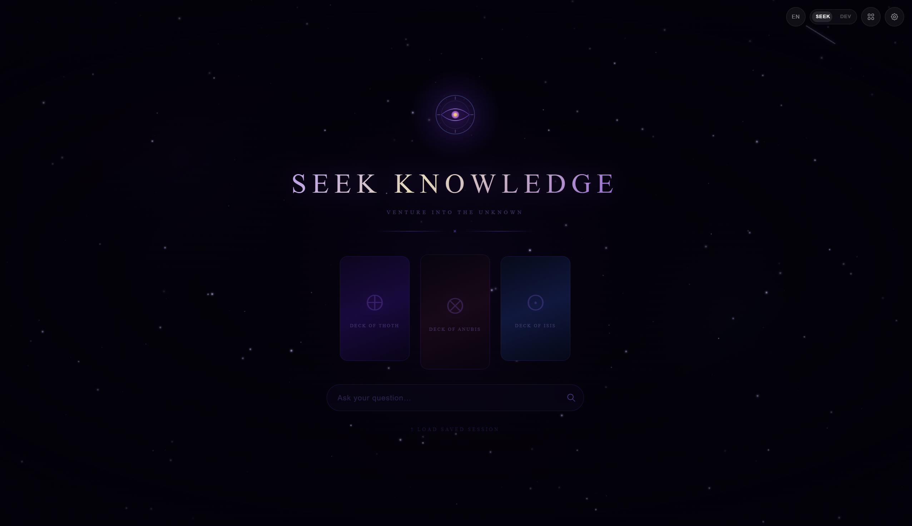
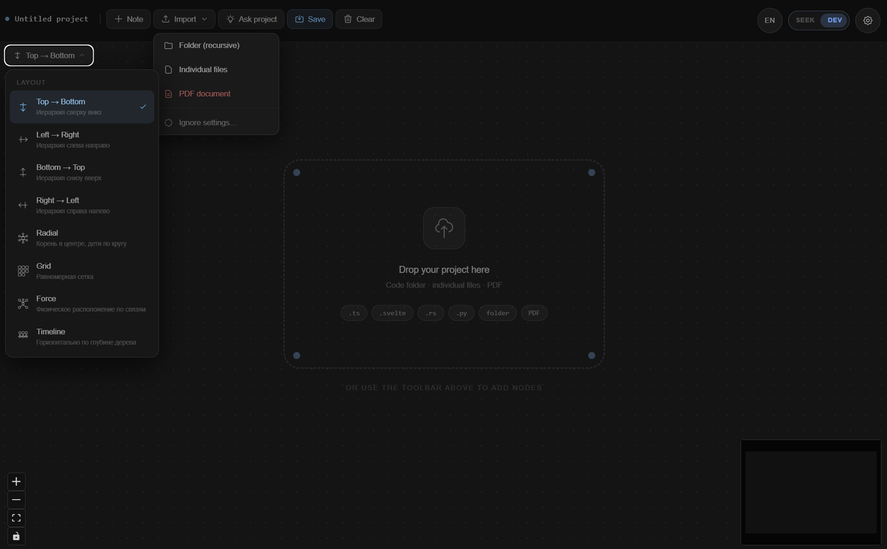
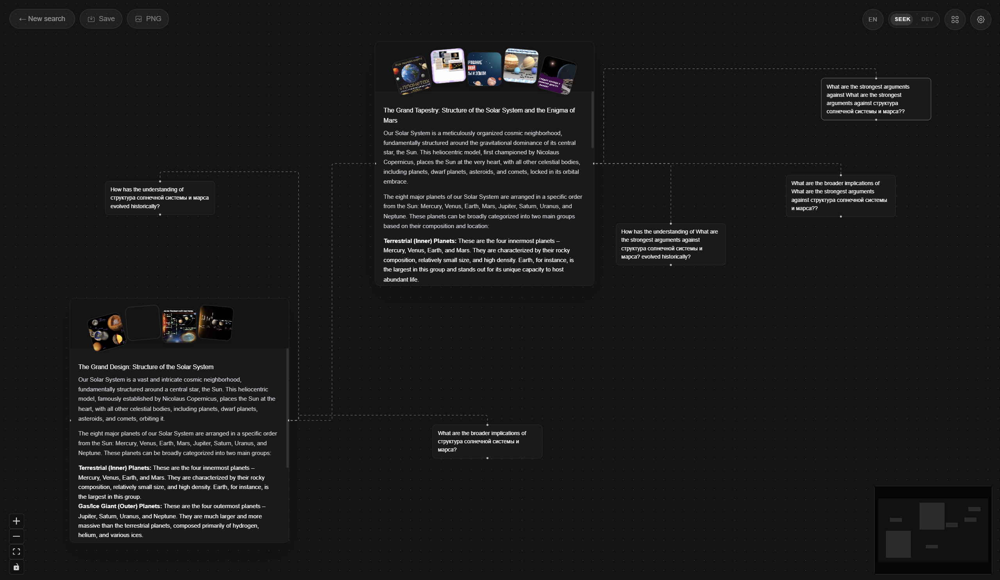
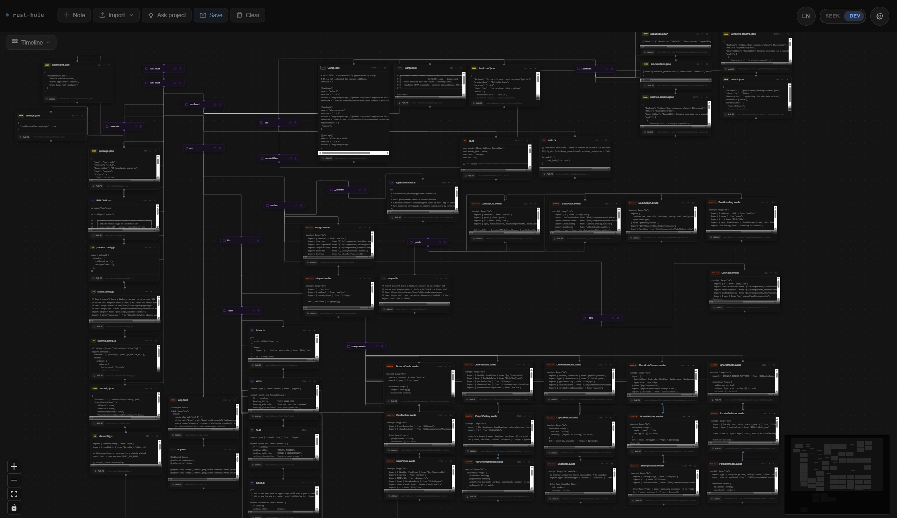

<a name="top"></a>

<div align="center">




# ∞ Infinity Loop

**Every answer opens a new question.**  
Type any topic — get an interactive knowledge graph of connected concepts, sources, and ideas, generated by AI.

[](LICENSE)
[](https://tauri.app)
[](https://svelte.dev)
[](https://www.rust-lang.org)
[](https://github.com/Ar3love/infinity-loop/releases)

<p>
  <a href="#-what-is-this">About</a> &nbsp;·&nbsp;
  <a href="#-screenshots">Screenshots</a> &nbsp;·&nbsp;
  <a href="#-quick-start">Quick Start</a> &nbsp;·&nbsp;
  <a href="#%EF%B8%8F-settings">Settings</a> &nbsp;·&nbsp;
  <a href="#%EF%B8%8F-keyboard-shortcuts">Shortcuts</a> &nbsp;·&nbsp;
  <a href="#-tech-stack">Tech Stack</a>
</p>

[](https://x.com/intent/tweet?text=Check%20out%20Infinity%20Loop%20%E2%80%94%20an%20AI%20knowledge%20graph%20explorer%20built%20with%20Tauri%20%2B%20Svelte%20%2B%20Rust%20%F0%9F%94%8D%E2%9C%A8%20https://github.com/Ar3love/infinity-loop)
[](https://www.reddit.com/submit?title=Infinity%20Loop%20%E2%80%94%20AI%20knowledge%20graph%20explorer%20built%20with%20Tauri%20%2B%20Rust&url=https://github.com/Ar3love/infinity-loop)
[](https://t.me/share/url?url=https://github.com/Ar3love/infinity-loop&text=Infinity%20Loop%20%E2%80%94%20AI%20knowledge%20graph%20explorer)

</div>

---

## ✨ What is this

Infinity Loop is a desktop app for **visual knowledge exploration**.  
You type a concept — "Quantum Entanglement", "History of Jazz", "How TCP/IP works" — and AI builds a live graph: idea nodes, connections between them, sources and images pulled straight from the web.

There are two modes:

- **🔍 Seek** — AI search mode. Ask a question → Gemini + Tavily build the graph.
- **🛠 Dev** — file analysis mode. Load a codebase → AI maps out the architecture.

---

## 🖼 Screenshots

<div align="center">
  
  <sub><i>Seek mode — enter any topic to start exploring</i></sub>
</div>

<br/>

<div align="center">
  
  <sub><i>Dev mode — load a codebase and explore its architecture</i></sub>
</div>

---

## 🚀 Quick Start

### Prerequisites

| Tool | Version | Why |
|---|---|---|
| [Node.js](https://nodejs.org) | 18+ | Frontend build |
| [Rust](https://rustup.rs) | stable | Backend |
| [Tauri CLI](https://tauri.app/start/prerequisites/) | 2.x | App bundling |
| Tavily API key | — | Web search |
| Gemini API key | — | AI generation |

### Installation

```bash
# 1. Clone the repo
git clone https://github.com/Ar3love/infinity-loop.git
cd infinity-loop

# 2. Install dependencies
npm install

# 3. Run in dev mode
npm run tauri dev
```

Once the app is running, click ⚙ in the top-right corner and enter your API keys.  
Keys are stored in memory only — never sent anywhere except the official APIs.

---

## 🔑 API Keys

The app uses two external services:

**Tavily Search** — web search with smart aggregation  
→ Get your key at [app.tavily.com](https://app.tavily.com) (free tier available)

**Google Gemini** — language model for graph generation  
→ Get your key at [Google AI Studio](https://aistudio.google.com/app/apikey) (free)

<!-- ╔══════════════════════════════════════════════════════════════════════╗ -->
<!-- ║  INSERT HERE: docs/screenshot-seek-graph.png                        ║ -->
<!-- ║  Full-width screenshot of Seek mode with a fully built AI graph     ║ -->
<!-- ║  Ideally: a beautiful topic with many nodes and connections visible  ║ -->
<!-- ╚══════════════════════════════════════════════════════════════════════╝ -->

<div align="center">
  
  <sub><i>Once your keys are set — type any topic and watch the AI build a live knowledge graph</i></sub>
</div>

---

## 🏗 Building a Release

### Windows — one installer for both Win 10 and Win 11

```bash
npm run tauri build
```

The installer will be at:
```
src-tauri/target/release/bundle/nsis/InfinityLoop_0.1.0_x64-setup.exe
```

> **Win 10 + Win 11 from a single build** — `tauri.conf.json` is configured with  
> `"webviewInstallMode": { "type": "embedBootstrapper" }`.  
> This means: if WebView2 is not installed (older Win 10), the installer will  
> automatically download and install it. On Win 11, WebView2 is already built-in.  
> **No need to rebuild for each OS.**

---

## ⚙️ Settings

Click the ⚙ icon in the top-right corner to access the settings panel.

- **API Keys** — enter your Tavily and Gemini keys
- **Language** — switch between English and Russian
- **Graphics Quality** — choose between **High** (smooth animations, full effects) and **Low** (better performance on older or integrated GPUs)

---

## ⌨️ Keyboard Shortcuts

| Key | Action |
|---|---|
| `Ctrl+S` | Save graph |
| `Ctrl+E` | Export as PNG |
| `Ctrl+R` | Reset / new search |
| `Escape` | Close modal |

---

## 🗂 Project Structure

```
infinity-loop/
├── src/                    # Frontend (SvelteKit + Svelte 5)
│   ├── lib/
│   │   ├── components/     # UI components
│   │   ├── i18n/           # Localization (EN / RU)
│   │   └── api.ts          # IPC calls to Rust backend
│   └── routes/
│       ├── _seek/          # AI search mode
│       └── _dev/           # Code analysis mode
│
└── src-tauri/              # Backend (Rust + Tauri 2)
    └── src/
        └── lib.rs          # Commands: search, sessions, API keys
```

<div align="center">
  
  <sub><i>Architecture map generated by Infinity Loop itself, using its own Dev mode 🐍</i></sub>
</div>

---

## 🛠 Tech Stack

- **[Tauri 2](https://tauri.app)** — native shell, IPC, filesystem access
- **[SvelteKit](https://kit.svelte.dev) + Svelte 5** — reactive UI with runes
- **[Xyflow/Svelte](https://svelteflow.dev)** — interactive node graph
- **[Tailwind CSS](https://tailwindcss.com)** — styling
- **[GSAP](https://gsap.com)** — animations
- **Rust** — HTTP client (reqwest), session storage, API proxy

---

## 🌍 Localization

The app supports **English** and **Russian**.  
Use the language switcher in the bottom-left corner.

To add a new language: copy `src/lib/i18n/en.ts` and translate the strings.

---

## 📄 License

MIT © [Ar3love](https://github.com/Ar3love)

---

<div align="center">
<sub>
Inspired by <a href="https://rabbitholes.ai">RabbitHoles AI</a> — for the idea of endless, curiosity-driven exploration.
</sub>
<br/><br/>
<a href="#top">↑ Back to top</a>
</div>

<!-- ╔══════════════════════════════════════════════════════╗ -->
<!-- ║  OPTIONAL: add a link to a video demo               ║ -->
<!-- ║  [](your-video-url)    ║ -->
<!-- ╚══════════════════════════════════════════════════════╝ -->